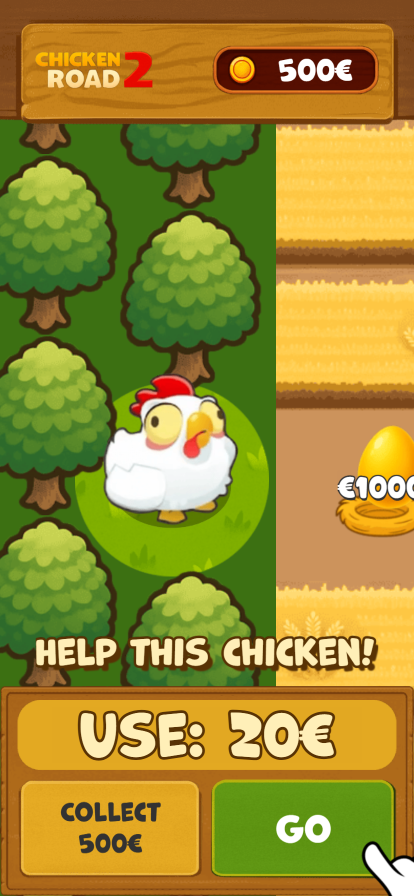
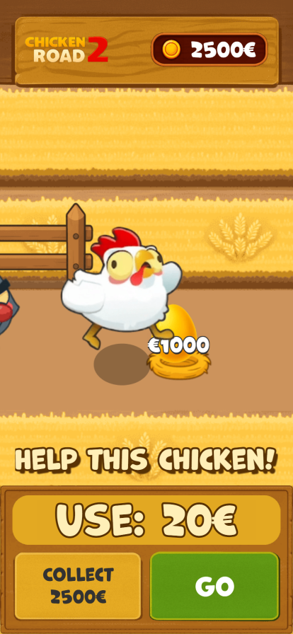
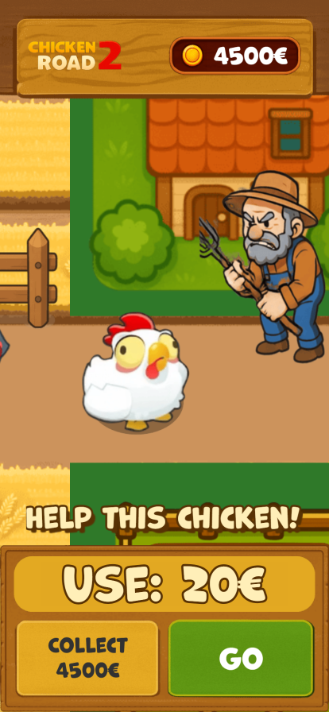
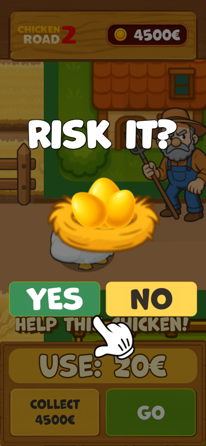
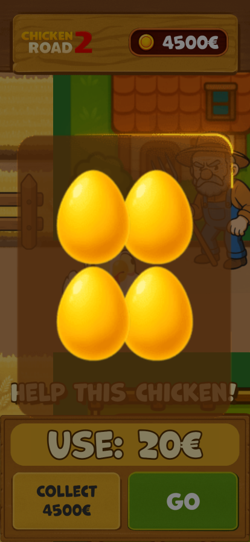
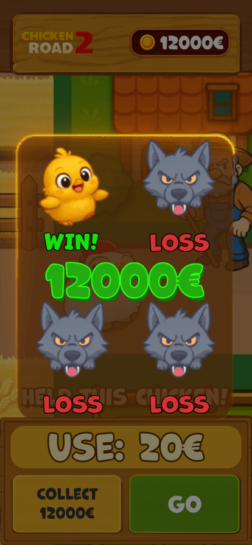

# CR_Farm

[English version](README.md)

## О проекте

Проект был разработан по заказу клиента через третьих лиц.

Оригинальные файлы проекта подпадают под соглашение о неразглашении (NDA) и не могут быть опубликованы.

## Скриншоты

<table>
  <tr>
    <td></td>
    <td></td>
    <td></td>
    <td></td>
  </tr>
  <tr>
    <td></td>
    <td></td>
    <td></td>
    <td></td>
  </tr>
</table>

## Демо

[Открыть демо](https://mitfart.github.io/C.CR_Farm/)
